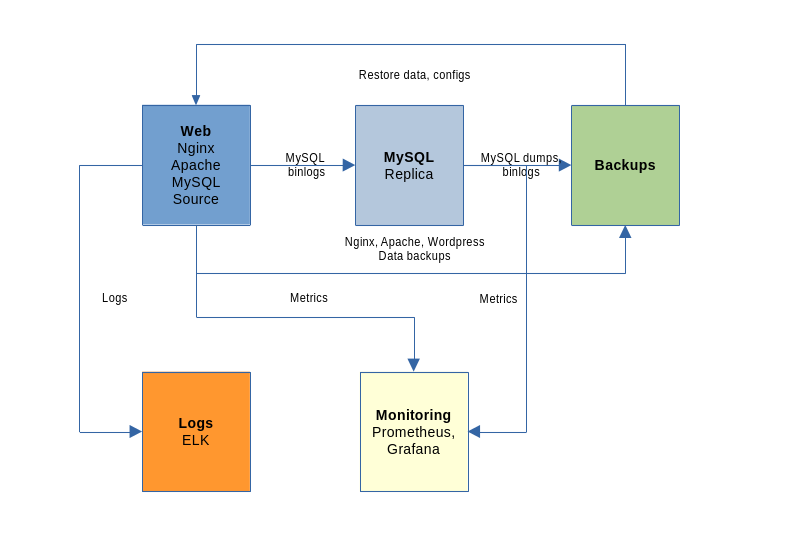

# OTUS. Administrator Linux. Basic. Материалы для итоговой работы курса.

Тема: Разработка системы резервного копирования и восстановления веб-сервера и сервера логирования. 

### План защиты итоговой работы:
- План защиты итоговой работы.txt

### WEBSERVER
- файлы конфигураций nginx, apache2
- скрипт для создания резервной копии

### MYSQL. Резервное копирование DB и восстановление DB.

Сценарий создания резервной копии REPLICA и восстановление SOURCE

### LOGS. Сервер мониторинга Prometheus + Grafana.
***node_exporter*

- метрики localhost
- метрики сервера ELK
- метрики сервера MYSQL-SOURCE
- метрики сервера MYSQL-REPLICA

### ELK. Сервер логирования: 
- файлы конфигураций ES, K, LS, FB
- скрипты для установки пакетов и резервного копирования и восстановления файлов конфигураций

****

*Appendixs*

- минимальный набор правил iptables
- настройка доступа root по сертификату